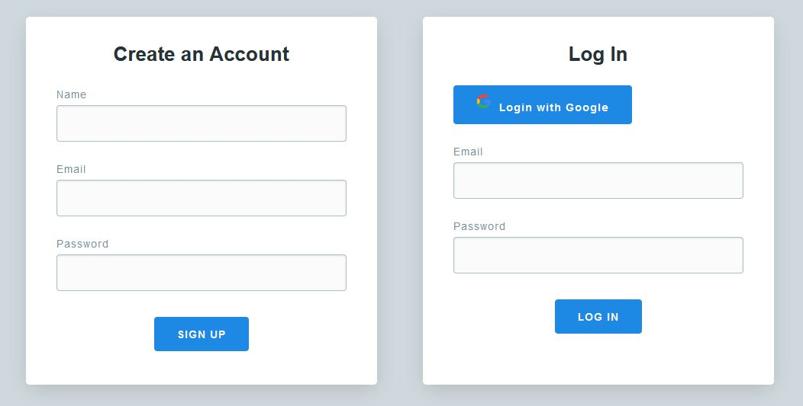

<h1 align="center">
  <!-- <a href="https://memoriasit.github.io/"> -->
   
  PhotoNet: Simple Flask Twitter/Instagram Clone
  </a>
</h1>

## This is a simple flask application which allows creating posts with hashtags and images.

The app was deployed in heroku, but API keys were deleted for security purposes, you are able to set this up if you just add your API keys.

### Some functionalities:
* Oauth Login
* Upload images to server
* Automatically detect hashtags from description
* CRUD of a post with MongoDB Atlas

> Note: 
This application was developed in less than 2 hours, therefore there are most likely errors, things that could have been better, etc.

# Previews

## Oauth Login

## Dashboard with some content

